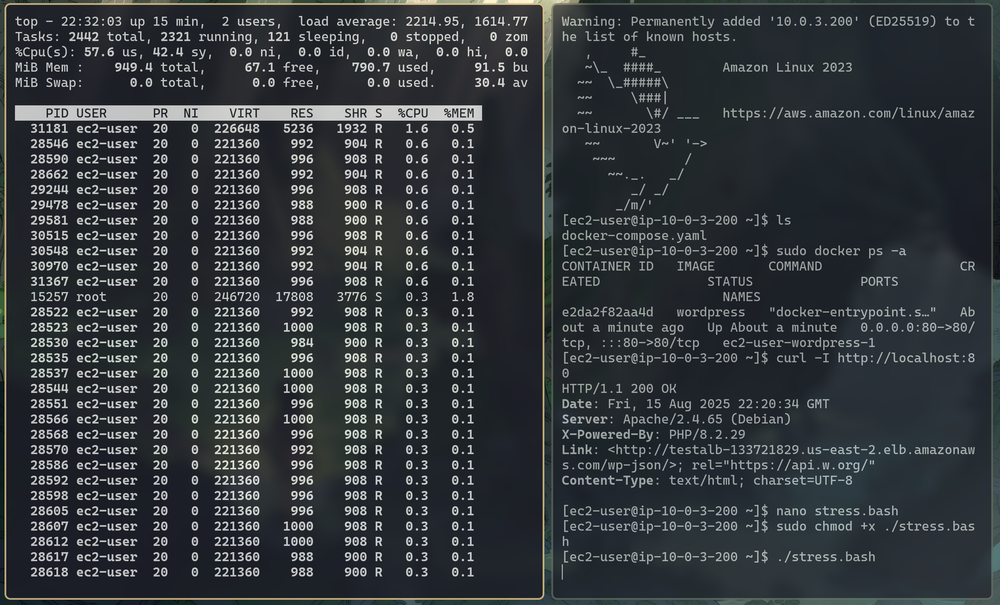

[](README.en.md)
[](README.md)

# Project 2 - Web Server Configuration Using WordPress and Docker on AWS

## Project Overview

The objective of this project is to configure a robust and scalable infrastructure on Amazon Web Services (AWS) to host a WordPress web application. The solution will be built on a microservices architecture using **Docker**, ensuring high availability, automatic scalability, and security. The architecture will be based on an **Application Load Balancer (ALB)** to distribute traffic , an **Auto Scaling Group (ASG)** to manage the scalability of **EC2** instances , an **RDS** database for data persistence , and an **Elastic File System (EFS)** for shared storage of WordPress files. The network will be isolated in a **Virtual Private Cloud (VPC)**, with public and private subnets, and security will be managed through **Security Groups (SGs)** and a **Bastion Host**.

The project objective diagram is as follows:


## Technologies Used

* **Amazon Web Services (AWS)** 
* **Virtual Private Cloud (VPC)** 
* **EC2 (Elastic Compute Cloud)** 
* **RDS (Relational Database Service)** 
* **EFS (Elastic File System)** 
* **Application Load Balancer (ALB)** 
* **Auto Scaling Group (ASG)** 
* **IAM (Identity and Access Management)**
* **Docker**
* **WordPress**

## Summary

- 1.[Network Configuration](#1-network-configuration)
   - 1.1.[VPC Creation](#11-vpc-creation)
   - 1.2.[Subnet Creation](#12-subnet-creation)
   - 1.3.[Security Group (SG) Creation](#13-security-group-sg-creation)
   - 1.4.[Internet Gateway (IGW), NAT Gateways, and Route Tables Creation and Configuration](#14-internet-gateway-igw-nat-gateways-and-route-tables-creation-and-configuration)
- 2.[Database (RDS) Creation](#2-database-rds-creation)
- 3.[Elastic File System (EFS) Creation](#3-elastic-file-system-efs-creation)
- 4.[App Load Balancer (ALB), Auto Scaling Group (ASG), and Launch Template Creation](#4-app-load-balancer-alb-auto-scaling-group-asg-and-launch-template-creation)
   - 4.1.[IAM Role and Launch Template](#41-iam-role-and-launch-template)
   - 4.2.[App Load Balancer (ALB)](#42-app-load-balancer-alb)
   - 4.3.[Auto Scaling Group (ASG)](#43-auto-scaling-group-asg)
- 5.[Bastion Host](#5-bastion-host)
- 6.[Final Configurations](#6-final-configurations)
- 7.[Final Considerations and Operation](#7-final-considerations-and-operation)

---

## 1. Network Configuration

In this section, we will configure the foundation of our network infrastructure by creating a custom VPC with subnets, route tables, and gateways to ensure proper communication and isolation.

### 1.1. VPC Creation

The first step is to create our **VPC (Virtual Private Cloud)**, which will serve as an isolated virtual data center on AWS.

* `Name`: `desafio-wordpress-vpc`
* **IPv4 CIDR manual input**
* `CIDR block`: `10.0.0.0/16`
* **No IPv6 CIDR block**

### 1.2. Subnet Creation

Next, we will segment our VPC into subnets to organize and isolate resources. The public subnets will host external access components, while the private ones will house internal resources, such as EC2 instances and the database.

* **Public Subnet 1:**
    * `Name`: `subnet-wordpress-publica-1`
    * `Availability Zone`: `us-east-1a`
    * `CIDR block`: `10.0.1.0/24`
    * **Additional Configuration:** Enable "Auto-assign public IPv4 address" so that EC2 instances automatically receive public IPs.
* **Public Subnet 2:**
    * `Name`: `subnet-wordpress-publica-2`
    * `Availability Zone`: `us-east-1b`
    * `CIDR block`: `10.0.2.0/24`
    * **Additional Configuration:** Enable "Auto-assign public IPv4 address" so that EC2 instances automatically receive public IPs.
* **Private Subnet 1:**
    * `Name`: `subnet-wordpress-privada-1`
    * `Availability Zone`: `us-east-1a`
    * `CIDR block`: `10.0.3.0/24`
* **Private Subnet 2:**
    * `Name`: `subnet-wordpress-privada-2`
    * `Availability Zone`: `us-east-1b`
    * `CIDR block`: `10.0.4.0/24`

### 1.3. Security Group (SG) Creation

Now, let's define the network traffic rules for our components. The **Security Groups** will function as virtual firewalls, controlling inbound and outbound access for each service.

* `Name`: `DesafioWordpressALBSecurityGroup`
    * `Description`: Allow HTTP/HTTPS traffic from anywhere, directed to our Application Load Balancer.
    * `VPC`: `desafio-wordpress-vpc`
    * **Inbound Rules:**
        * **HTTP:** Allow traffic from `Anywhere` (`0.0.0.0/0`).
        * **HTTPS:** Allow traffic from `Anywhere` (`0.0.0.0/0`).
    * **Outbound Rules:**
        * **All traffic:** Keep default rule that allows traffic to `0.0.0.0/0`.
* `Name`: `DesafioWordpressEC2SecurityGroup`
    * `Description`: Control inbound traffic to EC2 instances, allowing only communication from the ALB and secure SSH connection.
    * `VPC`: `desafio-wordpress-vpc`
    * **Inbound Rules:**
        * **HTTP:** Allow traffic from `DesafioWordpressALBSecurityGroup`.
        * **NFS (2049):** Allow traffic from `DesafioWordpressEFSSecurityGroup`.
        * **SSH (22):** Allow traffic from `DesafioWordpressBastionHostSecurityGroup`.
    * **Outbound Rules:**
        * **All traffic:** Keep default rule that allows traffic to `0.0.0.0/0`.
* `Name`: `DesafioWordpressRDSSecurityGroup`
* `Description`: Ensure that only EC2 instances can communicate with the MySQL database.
    * `VPC`: `desafio-wordpress-vpc`
    * **Inbound Rules:**
      * **MYSQL/Aurora (3306):** Allow traffic from `DesafioWordpressEC2SecurityGroup`.
    * **Outbound Rules:**
      * **All traffic:** Keep default rule that allows traffic to `0.0.0.0/0`.
* `Name`: `DesafioWordpressEFSSecurityGroup`
    * `Description`: Allow EC2 instances to access the shared file system via NFS.
    * `VPC`: `desafio-wordpress-vpc`
    * **Inbound Rules:**
        * **NFS (2049):** Allow traffic from `DesafioWordpressEC2SecurityGroup`.
    * **Outbound Rules:**
        * **All traffic:** Keep default rule that allows traffic to `0.0.0.0/0`.
* `Name`: `DesafioWordpressBastionHostSecurityGroup`
    * `Description`: Limit SSH access to the Bastion Host only to your IP address, protecting the private network.
    * `VPC`: `desafio-wordpress-vpc`
    * **Inbound Rules:**
        * **SSH (22):** Allow traffic from `My IP`.
    * **Outbound Rules:**
        * **All traffic:** Keep default rule that allows traffic to `0.0.0.0/0`.

### 1.4. Internet Gateway (IGW), NAT Gateways, and Route Tables Creation and Configuration

In this step, we will configure internet access for our subnets. The **Internet Gateway** will allow inbound and outbound communication for public subnets , while the **NAT Gateways** will enable instances in private subnets to securely access the internet.

1. **Internet Gateway (IGW) Creation:**
    * `Name`: `igw-desafio-wordpress`
    * **Attach to VPC** `desafio-wordpress-vpc`.
2. **NAT Gateway Creation:**
    * `Name`: `nat-gateway-desafio-wordpress-1`
        * `Subnet`: `subnet-wordpress-publica-1`
        * `Connectivity type`: `Public`
        * **Allocate Elastic IP**.
    * `Name`: `nat-gateway-desafio-wordpress-2`
        * `Subnet`: `subnet-wordpress-publica-2`
        * `Connectivity type`: `Public`
        * **Allocate Elastic IP**.
3. **Public Route Table Creation:**
    * `Name`: `rtb-desafio-wordpress-publica`
    * `VPC`: `desafio-wordpress-vpc`.
    * **Routes:** Add a route with `Destination: 0.0.0.0/0` and `Target: igw-desafio-wordpress`.
    * **Subnet Associations:** Associate with `subnet-wordpress-publica-1` and `subnet-wordpress-publica-2`.
4. **Private Route Tables Creation:**
    * `Name`: `rtb-desafio-wordpress-privada-1`
    * `VPC`: `desafio-wordpress-vpc`.
    * **Routes:** Add a route with `Destination: 0.0.0.0/0` and `Target: nat-gateway-desafio-wordpress-1`.
    * **Subnet Associations:** Associate with `subnet-wordpress-privada-1`.
    * `Name`: `rtb-desafio-wordpress-privada-2`
    * `VPC`: `desafio-wordpress-vpc`.
    * **Routes:** Add a route with `Destination: 0.0.0.0/0` and `Target: nat-gateway-desafio-wordpress-2`.
    * **Subnet Associations:** Associate with `subnet-wordpress-privada-2`.

## 2. Database (RDS) Creation

In this step, we will provision a MySQL database instance managed by **Amazon RDS**. This ensures high availability and automatic backups, keeping our application data in a secure and isolated environment.

* `Engine`: `MySQL`
* `Templates`: `Free tier`
* `DB instance identifier`: `database-desafio-wordpress`
* **Configure and save the chosen password.**
* `DB instance class`: `db.t3.micro`
* `Storage type`: `General Purpose SSD (gp3)`
* `Allocated storage`: `20`
* **Connectivity**:
    * `VPC`: `desafio-wordpress-vpc`
    * `Public access`: `No`
    * `VPC security group`: **choose existing**
        * `Existing VPC security groups`: `DesafioWordpressRDSSecurityGroup`
    * `AZ`: `us-east-1a`
* `Database authentication`: `Password authentication`
* **Additional configuration**:
    * `Initial database name`: `wordpress`

## 3. Elastic File System (EFS) Creation

The **Amazon EFS** will be our shared file system, allowing all instances in the Auto Scaling Group to access the same WordPress files, such as themes, plugins, and media.

1.  **File System Settings**
  * `Name`: `WordPress File System`
  * `File system type`: `Regional`
  * `Automatic backups`: `Disabled`
  * `Transition into Archive`: `None`
2.  **Network Access**
  * `VPC`: `desafio-wordpress-vpc`
  * `Mount targets`:
    * `us-east-1a`
      * `subnet-wordpress-privada-1`
      * `IPv4 only`
      * `DesafioWordpressEFSSecurityGroup`
    * `us-east-1b`
      * `subnet-wordpress-privada-2`
      * `IPv4 only`
      * `DesafioWordpressEFSSecurityGroup`

## 4. App Load Balancer (ALB), Auto Scaling Group (ASG), and Launch Template Creation

In this section, we will configure the main part of our scalable environment. The **Launch Template** will be the blueprint for the EC2 instances, the **Auto Scaling Group** will ensure that the number of instances adjusts to demand, and the **Application Load Balancer** will distribute traffic among them.

### 4.1. IAM Role Secrets Manager and Launch Template

We will start by configuring an **IAM Role** for the EC2 instances. In this project, we need to grant permission for the **EC2** to *describe available AZs*, *retrieve our passwords stored in AWS*, *describe available databases*, and *describe available EFS filesystems*. Then, we will create the **Launch Template** that will serve as the basis for our Auto Scaling Group.

1.  **IAM Role**
  * `Trusted entity type`: `AWS service`
  * `Service or use case`: `EC2`
  * `Permissions policies`: `AmazonElasticFileSystemClientReadWriteAccess`
  * `Role name`: `EC2-Wordpress-Role`
  * `Description`: `Allows EC2 instances to call AWS services on your behalf.`
  * **After creation, add the permissions (Create inline policy):**
    * **EC2-DescribeAZ**
      * `Service`: `EC2`
      * `Action`: `DescribeAvailabilityZones`
    * **SM-GetSecret**
      * `Service`: `Secrets Manager`
      * `Action`: `GetSecretValue`
      * `Resources`: **All**
    * **RDS-DBInstances**
      * `Service`: `RDS`
      * `Action`: `DescribeDBInstances`
      * `Resources`: **All**
    * **EFS-DescribeFS**
      * `Service`: `EFS`
      * `Action`: `DescribeFileSystems`
      * `Resources`: **All**
    * `Policy name`: `EC2CustomPolicy`

2. **Secrets Manager**
  * `Secret type`: **Credentials for Amazon RDS database**
  * `User name`: `admin`
  * `Password`: **enter your RDS database password**
  * **Choose our database** `database-desafio-wordpress`
  * `Secret name`: `DBSecret`
  * `Description`: `Secrets for Wordpress MySQL DB`

3.  **Launch Template**
  * `Name`: `WordpressTemplate`
  * `Description`: `Template for EC2 hosting Wordpress in Docker.`
  * `Auto scaling guidance`: `Enabled`
  * `Application and OS Images`
    * `Amazon Linux 2023 kernel-6.1 AMI`
  * `Instance type`
    * `t2.micro`
  * `Key pair`: **configure and select a key pair correctly.**
  * `Network settings`
    * `Subnet`: **we will not configure any subnet for now.**
    * `Common security groups`: `DesafioWordpressEC2SecurityGroup`
  * `Resource tags` (remember to select both instances and volumes in ***resource types***):
    * `Name`: `WordpressServer`
    * `CostCenter`: `**********`
    * `Project`: `PB - JUN 2025`
    * `Advance details`
      * `IAM instance profile`: `EC2-Wordpress-Role`
      * `User data`: **Add and configure the user data correctly, ensuring the installation of Docker and the connection to EFS and RDS. In this example, we will use the `user-data.bash` file from this repository.**

### 4.2. App Load Balancer (ALB)

We will first create a **Target Group** to facilitate the configuration of the Application Load Balancer. This group will receive instances from our ASG.

1. **Target Groups**
  * `Target type`: `Instances`
  * `Name`: `WordpressTG`
  * `Protocol`: `HTTP`
* `Port`: `80`
  * `VPC`: `desafio-wordpress-vpc`
  * `Health check protocol`: `HTTP`
  * `Health check path`: `/`
  * **Advanced health check settings:**
    * `Success codes`: `200,302`

2. **Application Load Balancer**
  * `Name`: `WordpressALB`
  * `Scheme`: `Internet-facing`
  * `Load balancer IP address type`: `IPv4`
  * `VPC`: `desafio-wordpress-vpc`
  * `AZ and subnets`: **select both AZs we are using (`us-east-1a`, `us-east-1b`) and our public subnets for each AZ.**
  * `Security group`: `DesafioWordpressALBSecurityGroup`
  * `Listeners and routing`: `HTTP:80 -> WordpressTG`

### 4.3. Auto Scaling Group (ASG)

The **Auto Scaling Group** will use the Launch Template to launch EC2 instances in the private subnets and connect them to the Target Group of our Load Balancer, scaling the number of servers based on CPU usage.

* **Choose launch template**
  * `Name`: `WordpressASG`
  * `Launch template`: `WordpressTemplate`
* **Choose instance launch options**
  * `VPC`: `desafio-wordpress-vpc`
  * `AZ and subnets`: **select our private subnets (`subnet-wordpress-privada-1`, `subnet-wordpress-privada-2`).**
* **Integrate with other services**
  * `Load balancing`: `Attach to an existing load balancer`
    * `WordpressTG`
  * `Turn on Elastic Load Balancing health checks`: `Enabled`
    * `Health check grace period`: `300 seconds`
* **Configure group size and scaling**
  * `Desired capacity`: `2`
  * `Min desired capacity`: `1`
  * `Max desired capacity`: `4`
  * `Target tracking scaling policy`
    * `Scaling policy name`: `Wordpress Target Tracking Policy`
    * `Metric type`: `Average CPU utilization`
      * `Target value`: `65`
      * `Instance warmup`: `300`

## 5. Bastion Host

We will create a **Bastion Host** to allow secure SSH access to the private EC2 instances without exposing these machines to the internet.

* `Tags`(remember to select both instances and volumes in ***resource types***):
  * `Name`: `WordpressBastionHost`
  * `CostCenter`: `**********`
  * `Project`: `PB - JUN 2025`
* `Application and OS Images`: `Amazon Linux 2023`
* `Instance type`: `t2.micro`
* `Key pair name`: **choose your key pair.**
* **Network settings**:
  * `VPC`: `desafio-wordpress-vpc`
  * `Subnet`: `subnet-wordpress-publica-1`
  * `Auto-assign public IP`: `Enable`
  * `Security groups`: `DesafioWordpressBastionHostSecurityGroup`
* **Additional Configurations:**
    * Copy your .pem key to the Bastion Host so that it can access the other machines:
        ```sh
            $ scp -i <KEY NAME>.pem <KEY NAME>.pem ec2-user@<BASTION HOST IP>:/home/ec2-user/
        ```

## 6. Final Configurations

To finalize the configuration, it is essential to validate the communication between all components, test website access, and scalability.

1. **Check instance health:** After creating the Auto Scaling Group, verify that the EC2 instances are healthy and communicate correctly with EFS and RDS.
2. **Test access via Bastion Host:** Connect to the Bastion Host via SSH and, from there, access one of the private EC2 instances to check internal communication and service installation.
3. **Access the application:** Get the DNS of the Application Load Balancer and access the site. The WordPress configuration page should appear.
4. **Finalize the WordPress configuration:** Complete the WordPress installation by creating your default user and logging in to both the admin panel and checking the template site.

---

## 7. Final Considerations and Operation

Stack related to the creation of sections [1](#1-network-configuration), [2](#2-database-rds-creation), and [3](#3-elastic-file-system-efs-creation):


Target group checking the status of the machines and our WordPress site running inside the containers:


Running instances:


Connecting to the Bastion Host and the WordPress Server and checking the running container:


Testing to bring down the container:


Replaced:


Login still working, since our file system and database are shared:


After running the script to test CPU stress:




### 7.1 Final Considerations:

This project allows for practical experience with robust solutions using AWS services, building a secure, resilient, and self-healing structure, enabling high accessibility and availability. Furthermore, it provides a good foundation for problem-solving and Linux systems.

Furthermore, it is important to note that while this project is excellent for testing/development purposes, for production environments, it would be beneficial to keep more machines active at the same time (given the delay in AWS's response during our tests), and to keep the App Load Balancer closer to our clients and not in a random region.

***Important reminder***: To avoid costs, do not forget to delete all the resources created for this project after use. Check costs daily in the Cost Explorer to prevent unwanted charges.