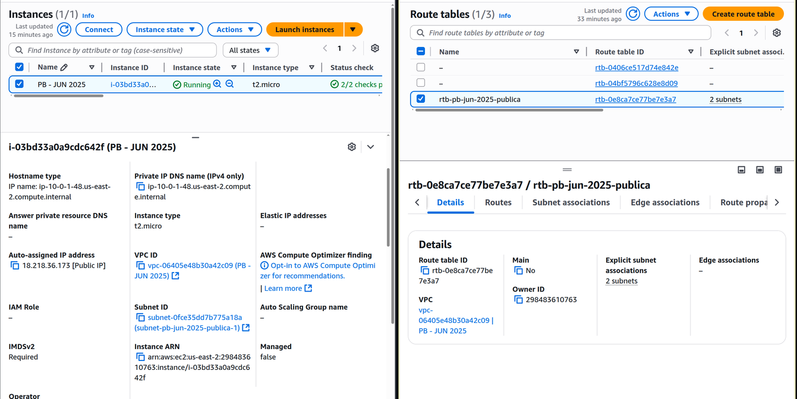
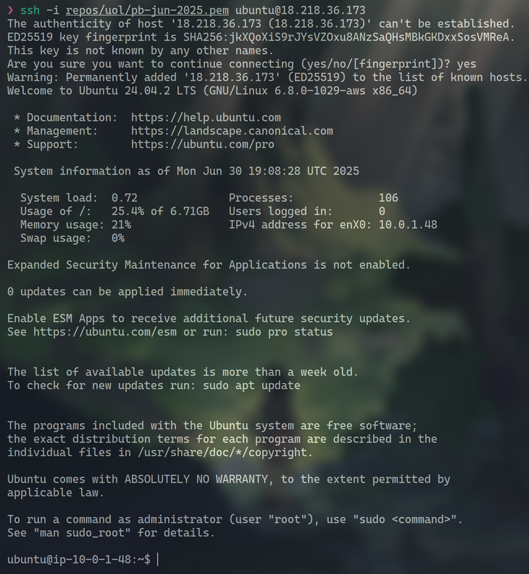
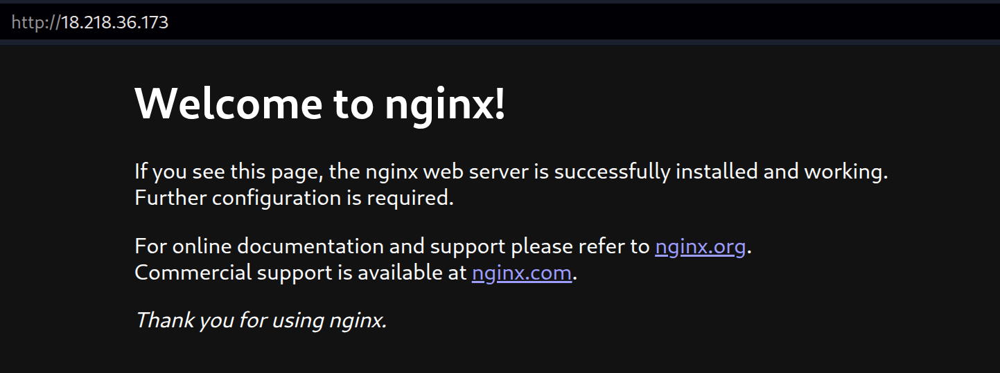
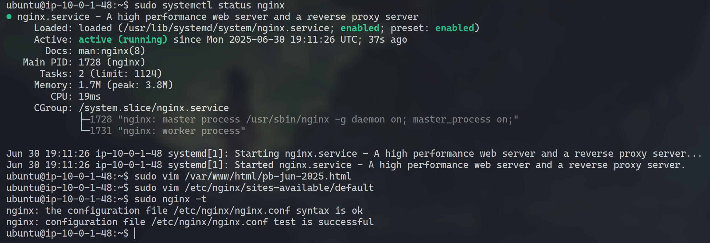
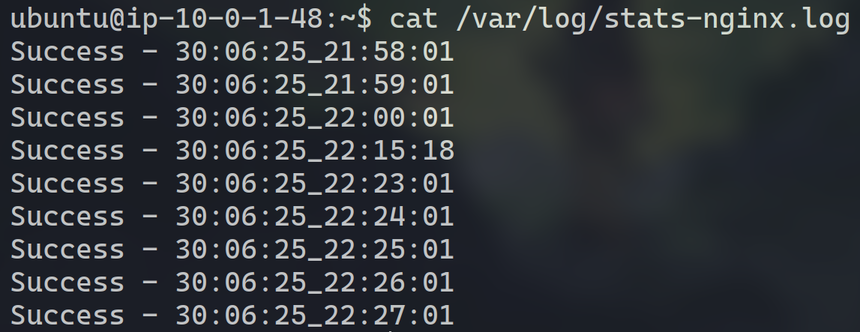
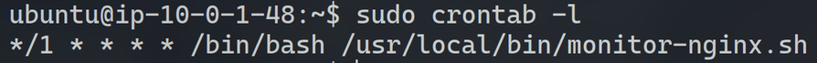
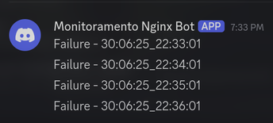
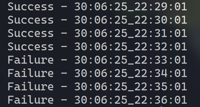

[](README.en.md)
[](README.md)

# Projeto 1 - Configuração de Servidor Web com Monitoramento na AWS

Este projeto visa desenvolver e testar habilidades básicas em Linux, Amazon Web Services (AWS) e automação de processos. O objetivo principal é configurar um ambiente de servidor web monitorado Nginx na AWS, que inclua monitoramento de disponibilidade e notificações automáticas em caso de indisponibilidade do serviço.

## Sumário

- [Projeto 1 - Configuração de Servidor Web com Monitoramento na AWS](#projeto-1---configuração-de-servidor-web-com-monitoramento-na-aws)
  - [Sumário](#sumário)
  - [1 Configuração do Ambiente](#1-configuração-do-ambiente)
    - [1.1 Criação da VPC](#11-criação-da-vpc)
    - [1.2 Criação das Sub-redes](#12-criação-das-sub-redes)
    - [1.3 Criação e Configuração do Internet Gateway (IGW) e Tabelas de Roteamento](#13-criação-e-configuração-do-internet-gateway-igw-e-tabelas-de-roteamento)
    - [1.4 Configuração da Instância EC2](#14-configuração-da-instância-ec2)
    - [1.5 Resultado](#15-resultado)
    - [1.6 Acessar a Máquina via SSH](#16-acessar-a-máquina-via-ssh)
  - [2 Configuração do Servidor Web](#2-configuração-do-servidor-web)
    - [2.1 Instalação e Inicialização do Nginx](#21-instalação-e-inicialização-do-nginx)
    - [2.2 Criação da Página HTML customizada](#22-criação-da-página-html-customizada)
    - [2.3 Configuração do Nginx](#23-configuração-do-nginx)
    - [2.4 Testar e Aplicar a Configuração do Nginx](#24-testar-e-aplicar-a-configuração-do-nginx)
  - [3 Monitoramento e Notificações](#3-monitoramento-e-notificações)
    - [3.1 Criação do Script de Monitoramento](#31-criação-do-script-de-monitoramento)
    - [3.2 Configurar o Script para Rodar Automaticamente (Cron)](#32-configurar-o-script-para-rodar-automaticamente-cron)
  - [4 Teste e automação](#4-teste-e-automação)
  - [5. Referências](#5-referências)

## 1 Configuração do Ambiente

### 1.1 Criação da VPC
- `Name`: `PB - JUN 2025`
- IPv4 CIDR manual input
- Bloco CIDR: `10.0.0.0/16`
- No IPv6 CIDR block
- **Tags (essas serão nossas tags default):**
- `CostCenter`: `**********`
- `Project`: `PB - JUN 2025`

### 1.2 Criação das Sub-redes

Todas vão ser criadas na VPC que acabamos de criar

**Sub-rede Pública 1:**
- `Name`: `subnet-pb-jun-2025-publica-1`
- Zona de Disponibilidade: `us-east-2a`
- Bloco CIDR: `10.0.1.0/24`
- `Aplicar Tags`
- **Configuração Adicional:** Habilitar "Auto-assign public IPv4 address" para que as instâncias EC2 recebam IPs públicos automaticamente.

**Sub-rede Pública 2:**
- `Name`: `subnet-pb-jun-2025-publica-2`
- Zona de Disponibilidade: `us-east-2b` (Sugestão: usar uma AZ diferente da primeira pública para maior resiliência)
- Bloco CIDR: `10.0.2.0/24`
- `Aplicar Tags`
- **Configuração Adicional:** Habilitar "Auto-assign public IPv4 address".

**Sub-rede Privada 1:**
- `Name`: `subnet-pb-jun-2025-privada-1`
- Zona de Disponibilidade: `us-east-2a`
- Bloco CIDR: `10.0.3.0/24`
- `Aplicar Tags`

**Sub-rede Privada 2:**
- `Name`: `subnet-pb-jun-2025-privada-2`
- Zona de Disponibilidade: `us-east-2b` (Sugestão: usar uma AZ diferente da primeira privada para maior resiliência)
- Bloco CIDR: `10.0.4.0/24`
- `Aplicar Tags`

### 1.3 Criação e Configuração do Internet Gateway (IGW) e Tabelas de Roteamento

1.  **Criação do Internet Gateway (IGW):**
    - `Name`: `igw-pb-jun-2025`
    - `Aplicar Tags`
    - `Ações` > `Anexar à uma VPC` > `Anexar IGW na nossa VPC`

2.  **Criação da Tabela de Roteamento Pública:**
    - `Name`: `rtb-pb-jun-2025-publica`
    - **VPC:** `PB - JUN 2025`.
    -   `Aplicar Tags`

    - **Rotas:** Adicionar uma rota com `Destination: 0.0.0.0/0` (todo o tráfego da internet) e `Target: igw-pb-jun-2025`.
    - **Associações de Sub-rede:** Associar esta tabela de roteamento às sub-redes públicas (`subnet-pb-jun-2025-publica-1` e `subnet-pb-jun-2025-publica-2`).

### 1.4 Configuração da Instância EC2

-   **Nome:** `PB - JUN 2025` (instâncias e volumes)
-   `Aplicar Tags` (instâncias e volumes)
-   **Sistema Operacional (OS):** `Ubuntu` 
-   **Tipo de Instância:** `t2.micro` 
-   **Key Pair:** Criar um novo par de chaves ou selecionar um existente (`pb-jun-2025`).
-   **Configurações de Rede:** 
    -   **VPC:** `PB - JUN 2025`.
    -   **Subnet:** `subnet-pb-jun-2025-publica-1`. 
    -   **Auto-assign public IP:** `Enable`.
    -   **Security Group:** Criar um novo Security Group. 
        -   **Name:** `pb-jun-2025-web`
        -   **Description:** `Security Group for Compass UOL PB project 1 (JUN 2025)`
        -   **Regras de Entrada (Inbound Rules):**
            -   **SSH (Porta 22):** Permitir tráfego do seu IP (por segurança). 
            -   **HTTP (Porta 80):** Permitir tráfego de `Anywhere` (`0.0.0.0/0`) para que o site seja acessível publicamente.

### 1.5 Resultado



### 1.6 Acessar a Máquina via SSH

```sh
chmod 400 pb-jun-2025.pem
ssh -i pb-jun-2025.pem ubuntu@<IP da máquina>
```



## 2 Configuração do Servidor Web

### 2.1 Instalação e Inicialização do Nginx

Dentro da instância EC2 (via SSH):

```sh
sudo apt-get update
sudo apt-get upgrade
sudo apt-get install nginx 
sudo systemctl enable nginx # Garante que o Nginx inicie automaticamente com o sistema.
sudo systemctl status nginx # A saída esperada é 'enabled' e 'active (running)'.
```



### 2.2 Criação da Página HTML customizada

```sh
sudo vim /var/www/html/pb-jun-2025.html
```

**Adicione o seu conteúdo no arquivo**

### 2.3 Configuração do Nginx

Para garantir que a página padrão do Nginx continue acessível em `http://<IP_DA_MAQUINA>/` e sua nova página em `http://<IP_DA_MAQUINA>/pb-jun-2025`, editaremos o arquivo de configuração padrão. 

```sh
sudo vim /etc/nginx/sites-available/default
```

A configuração deve ficar assim:

```sh
server {
    listen 80 default_server;
    listen [::]:80 default_server;

    root /var/www/html;

    # No meu caso específico o arquivo html default criado é index.nginx-debian.html
    index index.html index.nginx-debian.html;

    # Este bloco específico para a URL /pb-jun-2025 que deve ser adicionado
    location = /pb-jun-2025 {
        try_files /pb-jun-2025.html =404;
    }

    location / {
        try_files $uri $uri/ =404;
    }
}
```

### 2.4 Testar e Aplicar a Configuração do Nginx

1.  **Testar a sintaxe da configuração do Nginx:**

```sh
sudo nginx -t
```

2.  **Recarregar o Nginx:**
    Aplicar as novas configurações sem interromper o serviço.

```sh
sudo systemctl reload nginx
```



## 3 Monitoramento e Notificações

### 3.1 Criação do Script de Monitoramento

É recomendado que scripts de sistema fiquem em `/usr/local/bin/` ou `/opt/scripts/`.

```sh
sudo vim /usr/local/bin/monitor-nginx.sh
```

Script:

```sh
#!/bin/bash

SERVER_URL="<ec2_ip>/pb-jun-2025"

LOG_FILE="/var/log/stats-nginx.log"

http_code=$(curl -s -w "%{http_code}" -o /dev/null "$SERVER_URL") # faz a requisição HTTP para o servidor e filtra apenas o http_code
if [ $http_code = 200 ]; then # verifica se o http_code é 200: servidor respondeu normalmente
        message="Success - $(date +%d:%m:%y_%T)"
else
        message="Failure - $(date +%d:%m:%y_%T)"
        curl -X POST -H "Content-Type: application/json" -d "{\"content\": \"$message\"}" "$DISCORD_WEBHOOK" # faz o POST HTTP para o webhook do discord
fi

echo "$message" >> "$LOG_FILE" # faz o log da mensagem de log
```

Para o script funcionar é preciso criar a variável global **DISCORD_WEBHOOK**:

```sh
export DISCORD_WEBHOOK="<webhook>"
sudo vim /etc/environment # Colocar DISCORD_WEBHOOK="<webhook>"
```

Para testar vamos rodar

```sh
sudo bash /usr/local/bin/monitor-nginx.sh
```

Nenhuma mensagem deve aparecer. Mas você pode ver o output com:

```sh
sudo cat /var/log/stats-nginx.log
```



### 3.2 Configurar o Script para Rodar Automaticamente (Cron)

1.  **Edite o crontab do usuário `root`**, pois o script precisa de privilégios para escrever em `/var/log/`.

```sh
sudo crontab -e
```

2. **Adicione a seguinte linha no final do arquivo:**

```sh
*/1 * * * * /bin/bash /usr/local/bin/monitor-nginx.sh
```

Sendo os seguintes campos, separados por espaço: minuto, hora, dia, mês, dia da semana, shell, script.

Para verificar as crontabs existentes:
    
```sh
sudo crontab -l
```



## 4 Teste e automação

Para parar o processo do nginx e parar de disponibilizar a página:

```sh
sudo systemctl stop nginx
```

Podemos aproveitar essa chance para testar nossa notificação quando o servidor estiver caído



Podemos ver que depois de rodar o comando o programa começou a mandar notificações, podemos confirmar isso também pelo arquivo de log:



## 5. Referências

- [Amazon Virtual Private Cloud (VPC) Documentation](https://docs.aws.amazon.com/vpc/?icmpid=docs_homepage_featuredsvcs)
- [Amazon Elastic Compute Cloud (Amazon EC2) Documentation](https://docs.aws.amazon.com/ec2/?icmpid=docs_homepage_featuredsvcs)
- [Cron Jobs Configuration and Usage Guide](https://www.pantz.org/software/cron/croninfo)
