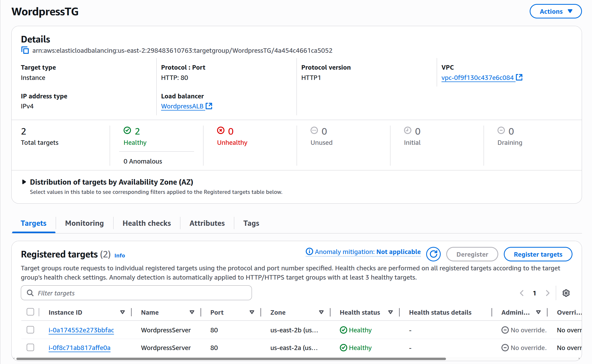
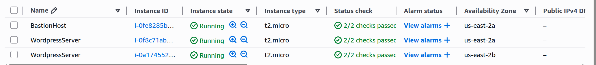
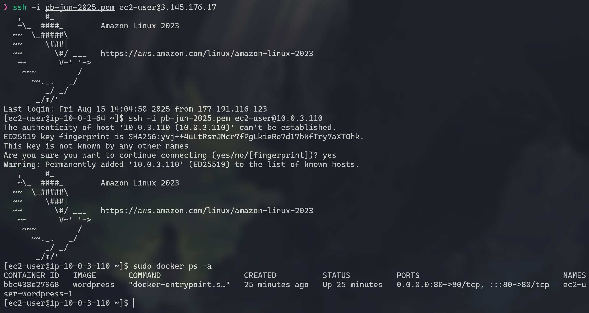
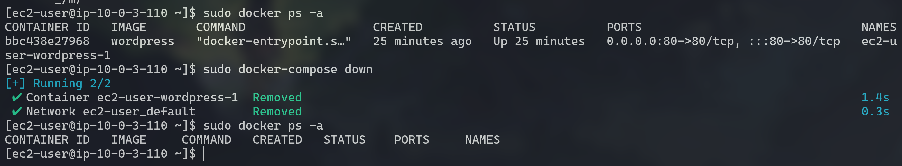
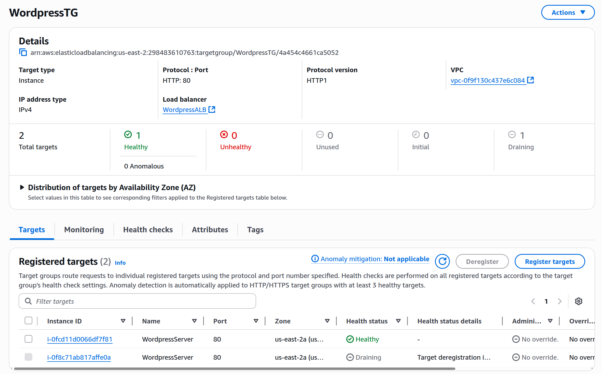

[](README.en.md)
[](README.md)

# Projeto 2 - Configuração de Servidor Web Utilizando WordPress e Docker na AWS

## Apresentação do Projeto

O objetivo deste projeto é configurar uma infraestrutura robusta e escalável na Amazon Web Services (AWS) para hospedar uma aplicação web WordPress. A solução será construída com base em uma arquitetura de microsserviços usando **Docker**, garantindo alta disponibilidade, escalabilidade automática e segurança. A arquitetura se baseará em um **Application Load Balancer (ALB)** para distribuir o tráfego, um **Auto Scaling Group (ASG)** para gerenciar a escalabilidade das instâncias **EC2**, um banco de dados **RDS** para persistência de dados e um **Elastic File System (EFS)** para o armazenamento compartilhado dos arquivos do WordPress. A rede será isolada em uma **Virtual Private Cloud (VPC)**, com sub-redes públicas e privadas, e a segurança será gerenciada por meio de **Security Groups (SGs)** e um **Bastion Host**.

O diagrama do objetivo do projeto é o seguinte:


## Tecnologias Utilizadas

* **Amazon Web Services (AWS)**
* **Virtual Private Cloud (VPC)**
* **EC2 (Elastic Compute Cloud)**
* **RDS (Relational Database Service)**
* **EFS (Elastic File System)**
* **Application Load Balancer (ALB)**
* **Auto Scaling Group (ASG)**
* **IAM (Identity and Access Management)**
* **Docker**
* **WordPress**

## Sumário

- 1.[Configuração da Rede](#1-configuração-da-rede)
    - 1.1.[Criação da VPC](#11-criação-da-vpc)
    - 1.2.[Criação das Sub-redes](#12-criação-das-sub-redes)
    - 1.3.[Criação dos Security Groups (SG)](#13-criação-dos-security-groups-sg)
    - 1.4.[Criação e Configuração do Internet Gateway (IGW), NAT Gateways e Tabelas de Roteamento](#14-criação-e-configuração-do-internet-gateway-igw-nat-gateways-e-tabelas-de-roteamento)
- 2.[Criação do Banco de Dados (RDS)](#2-criação-do-banco-de-dados-rds)
- 3.[Criação do Elastic File System (EFS)](#3-criação-do-elastic-file-system-efs)
- 4.[Criação do App Load Balancer (ALB), Auto Scaling Group (ASG) e Launch Template](#4-criação-do-app-load-balancer-alb-auto-scaling-group-asg-e-launch-template)
    - 4.1.[IAM Role e Launch Template](#41-iam-role-e-launch-template)
    - 4.2.[App Load Balancer (ALB)](#42-app-load-balancer-alb)
    - 4.3.[Auto Scaling Group (ASG)](#43-auto-scaling-group-asg)
- 5.[Bastion Host](#5-bastion-host)
- 6.[Configurações Finais](#6-configurações-finais)
- 7.[Considerações Finais e Funcionamento](#7-condiderações-finais-e-funcionamento)

---

## 1. Configuração da Rede

Nesta seção, vamos configurar a base de nossa infraestrutura de rede, criando uma VPC personalizada com sub-redes, tabelas de roteamento e gateways para garantir a comunicação e o isolamento adequados.

### 1.1. Criação da VPC

O primeiro passo é criar nossa **VPC (Virtual Private Cloud)**, que servirá como um datacenter virtual isolado na AWS.

* `Name`: `desafio-wordpress-vpc`
* **IPv4 CIDR manual input**
* `Bloco CIDR`: `10.0.0.0/16`
* **No IPv6 CIDR block**

### 1.2. Criação das Sub-redes

Em seguida, vamos segmentar nossa VPC em sub-redes para organizar e isolar os recursos. As sub-redes públicas hospedarão componentes de acesso externo, enquanto as privadas abrigarão os recursos internos, como as instâncias EC2 e o banco de dados.

* **Sub-rede Pública 1:**
    * `Name`: `subnet-wordpress-publica-1`
    * `Zona de Disponibilidade`: `us-east-1a`
    * `Bloco CIDR`: `10.0.1.0/24`
    * **Configuração Adicional:** Habilitar "Auto-assign public IPv4 address" para que as instâncias EC2 recebam IPs públicos automaticamente.
* **Sub-rede Pública 2:**
    * `Name`: `subnet-wordpress-publica-2`
    * `Zona de Disponibilidade`: `us-east-1b`
    * `Bloco CIDR`: `10.0.2.0/24`
    * **Configuração Adicional:** Habilitar "Auto-assign public IPv4 address" para que as instâncias EC2 recebam IPs públicos automaticamente.
* **Sub-rede Privada 1:**
    * `Name`: `subnet-wordpress-privada-1`
    * `Zona de Disponibilidade`: `us-east-1a`
    * `Bloco CIDR`: `10.0.3.0/24`
* **Sub-rede Privada 2:**
    * `Name`: `subnet-wordpress-privada-2`
    * `Zona de Disponibilidade`: `us-east-1b`
    * `Bloco CIDR`: `10.0.4.0/24`

### 1.3. Criação dos Security Groups (SG)

Agora, vamos definir as regras de tráfego de rede para nossos componentes. Os **Security Groups** funcionarão como firewalls virtuais, controlando o acesso de entrada e saída para cada serviço.

* `Name`: `DesafioWordpressALBSecurityGroup`
    * `Description`: Permitir tráfego HTTP/HTTPS de qualquer lugar, direcionado ao nosso Application Load Balancer.
    * `VPC`: `desafio-wordpress-vpc`
    * **Regras de Entrada (Inbound Rules):**
        * **HTTP:** Permitir tráfego de `Anywhere` (`0.0.0.0/0`).
        * **HTTPS:** Permitir tráfego de `Anywhere` (`0.0.0.0/0`).
    * **Regras de Saída (Outbound Rules):**
        * **All trafic:** Manter regra padrão que permite tráfego para `0.0.0.0/0`.
* `Name`: `DesafioWordpressEC2SecurityGroup`
    * `Description`: Controlar o tráfego de entrada para as instâncias EC2, permitindo apenas a comunicação do ALB e a conexão segura via SSH.
    * `VPC`: `desafio-wordpress-vpc`
    * **Regras de Entrada (Inbound Rules):**
        * **HTTP:** Permitir tráfego do `DesafioWordpressALBSecurityGroup`.
        * **NFS (2049):** Permitir tráfego do `DesafioWordpressEFSSecurityGroup`.
        * **SSH (22):** Permitir tráfego do `DesafioWordpressBastionHostSecurityGroup`.
    * **Regras de Saída (Outbound Rules):**
        * **All trafic:** Manter regra padrão que permite tráfego para `0.0.0.0/0`.
* `Name`: `DesafioWordpressRDSSecurityGroup`
    * `Description`: Garantir que apenas as instâncias EC2 possam se comunicar com o banco de dados MySQL.
    * `VPC`: `desafio-wordpress-vpc`
    * **Regras de Entrada (Inbound Rules):**
        * **MYSQL/Aurora (3306):** Permitir tráfego do `DesafioWordpressEC2SecurityGroup`.
    * **Regras de Saída (Outbound Rules):**
        * **All trafic:** Manter regra padrão que permite tráfego para `0.0.0.0/0`.
* `Name`: `DesafioWordpressEFSSecurityGroup`
    * `Description`: Permitir que as instâncias EC2 acessem o sistema de arquivos compartilhado via NFS.
    * `VPC`: `desafio-wordpress-vpc`
    * **Regras de Entrada (Inbound Rules):**
        * **NFS (2049):** Permitir tráfego do `DesafioWordpressEC2SecurityGroup`.
    * **Regras de Saída (Outbound Rules):**
        * **All trafic:** Manter regra padrão que permite tráfego para `0.0.0.0/0`.
* `Name`: `DesafioWordpressBastionHostSecurityGroup`
    * `Description`: Limitar o acesso SSH ao Bastion Host apenas ao seu endereço IP, protegendo a rede privada.
    * `VPC`: `desafio-wordpress-vpc`
    * **Regras de Entrada (Inbound Rules):**
        * **SSH (22):** Permitir tráfego de `My IP`.
    * **Regras de Saída (Outbound Rules):**
        * **All trafic:** Manter regra padrão que permite tráfego para `0.0.0.0/0`.

### 1.4. Criação e Configuração do Internet Gateway (IGW), NAT Gateways e Tabelas de Roteamento

Nesta etapa, vamos configurar o acesso à internet para nossas sub-redes. O **Internet Gateway** permitirá a comunicação de entrada e saída para as sub-redes públicas, enquanto os **NAT Gateways** permitirão que as instâncias nas sub-redes privadas acessem a internet de forma segura.

1. **Criação do Internet Gateway (IGW):**
    * `Name`: `igw-desafio-wordpress`
    * **Anexar à VPC** `desafio-wordpress-vpc`.
2. **Criação dos NAT Gateways:**
    * `Name`: `nat-gateway-desafio-wordpress-1`
        * `Subnet`: `subnet-wordpress-publica-1`
        * `Connectivity type`: `Public`
        * **Allocate Elastic IP**.
    * `Name`: `nat-gateway-desafio-wordpress-2`
        * `Subnet`: `subnet-wordpress-publica-2`
        * `Connectivity type`: `Public`
        * **Allocate Elastic IP**.
3. **Criação da Tabela de Roteamento Pública:**
    * `Name`: `rtb-desafio-wordpress-publica`
    * `VPC`: `desafio-wordpress-vpc`.
    * **Rotas:** Adicionar uma rota com `Destination: 0.0.0.0/0` e `Target: igw-desafio-wordpress`.
    * **Associações de Sub-rede:** Associar a `subnet-wordpress-publica-1` e `subnet-wordpress-publica-2`.
4. **Criação das Tabelas de Roteamento Privadas:**
    * `Name`: `rtb-desafio-wordpress-privada-1`
    * `VPC`: `desafio-wordpress-vpc`.
    * **Rotas:** Adicionar uma rota com `Destination: 0.0.0.0/0` e `Target: nat-gateway-desafio-wordpress-1`.
    * **Associações de Sub-rede:** Associar à `subnet-wordpress-privada-1`.
    * `Name`: `rtb-desafio-wordpress-privada-2`
    * `VPC`: `desafio-wordpress-vpc`.
    * **Rotas:** Adicionar uma rota com `Destination: 0.0.0.0/0` e `Target: nat-gateway-desafio-wordpress-2`.
    * **Associações de Sub-rede:** Associar à `subnet-wordpress-privada-2`.

## 2. Criação do Banco de Dados (RDS)

Nesta etapa, vamos provisionar uma instância de banco de dados MySQL gerenciada pelo **Amazon RDS**. Isso nos garante alta disponibilidade e backups automáticos, mantendo os dados da nossa aplicação em um ambiente seguro e isolado.

* `Engine`: `MySQL`
* `Templates`: `Free tier`
* `DB instance identifier`: `database-desafio-wordpress`
* **Configure e guarde a senha escolhida.**
* `DB instance class`: `db.t3.micro`
* `Storage type`: `General Purpose SSD (gp3)`
* `Allocated storage`: `20`
* **Connectivity**:
    * `VPC`: `desafio-wordpress-vpc`
    * `Public access`: `No`
    * `VPC security group`: **choose existing**
        * `Existing VPC security groups`: `DesafioWordpressRDSSecurityGroup`
    * `AZ`: `us-east-1a`
* `Database authentication`: `Password authentication`
* **Additional configuration**:
    * `Initial database name`: `wordpress`

## 3. Criação do Elastic File System (EFS)

O **Amazon EFS** será o nosso sistema de arquivos compartilhado, permitindo que todas as instâncias do Auto Scaling Group acessem os mesmos arquivos do WordPress, como temas, plugins e mídias.

1.  **File System Settings**
    * `Name`: `WordPress File System`
    * `File system type`: `Regional`
    * `Automatic backups`: `Desativado`
    * `Transition into Archive`: `None`
2.  **Network Access**
    * `VPC`: `desafio-wordpress-vpc`
    * `Mount targets`:
        * `us-east-1a`
            * `subnet-wordpress-privada-1`
            * `IPv4 only`
            * `DesafioWordpressEFSSecurityGroup`
        * `us-east-1b`
            * `subnet-wordpress-privada-2`
            * `IPv4 only`
            * `DesafioWordpressEFSSecurityGroup`

## 4. Criação do App Load Balancer (ALB), Auto Scaling Group (ASG) e Launch Template

Nesta seção, vamos configurar a parte principal do nosso ambiente escalável. O **Launch Template** será o modelo para as instâncias EC2, o **Auto Scaling Group** garantirá que o número de instâncias se ajuste à demanda e o **Application Load Balancer** distribuirá o tráfego entre elas.

### 4.1. IAM Role Secrets Manger e Launch Template

Vamos começar configurando um **IAM Role** para que as instâncias EC2 possam se conectar ao EFS. Além disso, para que nosso **User Data** funcione precisamos dar permissão para a **EC2** *descrever AZs disponíveis*, *buscar nossas senhas guardadas na aws*, *descrever os bancos disponíveis* e *descrever os EFS disponíveis*. Em seguida, vamos criar o **Launch Template** que servirá de base para o nosso Auto Scaling Group.

1.  **IAM Role**
    * `Trusted entity type`: `AWS service`
    * `Service or use case`: `EC2`
    * `Permissions policies`: `AmazonElasticFileSystemClientReadWriteAccess`
    * `Role name`: `EC2-Wordpress-Role`
    * `Description`: `Allows EC2 instances to call AWS services on your behalf.`
    * **Após a criação adicione as permissões (Create inline policy):**
        * **EC2-DescribeAZ**
            * `Service`: `EC2`
            * `Action`: `DescribeAvailabilityZones`
        * **SM-GetSecret**
            * `Service`: `Secrets Manager`
            * `Action`: `GetSecretValue`
            * `Resources`: **All**
        * **RDS-DBInstances**
            * `Service`: `RDS`
            * `Action`: `DescribeDBInstances`
            * `Resources`: **All**
        * **EFS-DescribeFS**
            * `Service`: `EFS`
            * `Action`: `DescribeFileSystems`
            * `Resources`: **All**
        * `Policy name`: `EC2CustomPolicy`

2. **Secrets Manager**
    * `Secret type`: **Credentials for Amazon RDS database**
    * `User name`: `admin`
    * `Password`: **coloque a senha do seu banco de dados RDS**
    * **Escolha nosso banco** `database-desafio-wordpress`
    * `Secret name`: `DBSecret`
    * `Description`: `Secrets for Wordpress MySQL DB`

3.  **Launch Template**
    * `Name`: `WordpressTemplate`
    * `Description`: `Template for EC2 hosting Wordpress in Docker.`
    * `Auto scaling guidance`: `Enabled`
    * `Application and OS Images`
        * `Amazon Linux 2023 kernel-6.1 AMI`
    * `Instance type`
        * `t2.micro`
    * `Key pair`: **configure e selecione corretamente um key pair.**
    * `Network settings`
        * `Subnet`: **não vamos configurar nenhuma subnet por agora.**
        * `Common security groups`: `DesafioWordpressEC2SecurityGroup`
    * `Resource tags` (lembre-se de selecionar tanto instâncias quanto volumes no ***resource types***):
        * `Name`: `WordpressServer`
        * `CostCenter`: `**********`
        * `Project`: `PB - JUN 2025`
    * `Advance details`
        * `IAM instance profile`: `EC2-Wordpress-Role`
        * `User data`: **Adicione e configure corretamente o user data, garantindo a instalação do Docker e a conexão com o EFS e RDS. Nesse exemplo vamos usar o arquivo desse repositório `user-data.bash`**

### 4.2. App Load Balancer (ALB)

Vamos primeiro criar um **Target Group** para facilitar a configuração do Application Load Balancer. Este grupo receberá as instâncias do nosso ASG.

1.  **Target Groups**
    * `Target type`: `Instances`
    * `Name`: `WordpressTG`
    * `Protocol`: `HTTP`
    * `Port`: `80`
    * `VPC`: `desafio-wordpress-vpc`
    * `Health check protocol`: `HTTP`
    * `Health check path`: `/`
    * **Advanced health check settings:**
        * `Success codes`: `200,302`

2.  **Application Load Balancer**
    * `Name`: `WordpressALB`
    * `Scheme`: `Internet-facing`
    * `Load balancer IP address type`: `IPv4`
    * `VPC`: `desafio-wordpress-vpc`
    * `AZ and subnets`: **selecionar ambas AZs que estamos usando (`us-east-1a`, `us-east-1b`) e nossas subnets públicas referente à cada AZ.**
    * `Security group`: `DesafioWordpressALBSecurityGroup`
    * `Listeners and routing`: `HTTP:80 -> WordpressTG`

### 4.3. Auto Scaling Group (ASG)

O **Auto Scaling Group** utilizará o Launch Template para iniciar as instâncias EC2 nas sub-redes privadas e as conectará ao Target Group do nosso Load Balancer, escalando o número de servidores com base no uso da CPU.

* **Choose launch template**
    * `Name`: `WordpressASG`
    * `Launch template`: `WordpressTemplate`
* **Choose instance launch options**
    * `VPC`: `desafio-wordpress-vpc`
    * `AZ and subnets`: **selecionar nossas subnets privadas (`subnet-wordpress-privada-1`, `subnet-wordpress-privada-2`).**
* **Integrate with other services**
    * `Load balancing`: `Attach to an existing load balancer`
        * `WordpressTG`
    * `Turn on Elastic Load Balancing health checks`: `Enabled`
    * `Health check grace period`: `300 segundos`
* **Configure group size and scaling**
    * `Desired capacity`: `2`
    * `Min desired capacity`: `1`
    * `Max desired capacity`: `4`
    * `Target tracking scaling policy`
        * `Scaling policy name`: `Wordpress Target Tracking Policy`
        * `Metric type`: `Average CPU utilization`
        * `Target value`: `65`
        * `Instance warmup`: `300`

## 5. Bastion Host

Vamos criar um **Bastion Host** para permitir um acesso seguro via SSH às instâncias EC2 privadas, sem expor essas máquinas à internet.

* `Tags`(lembre-se de selecionar tanto instâncias quanto volumes no ***resource types***):
    * `Name`: `WordpressBastionHost`
    * `CostCenter`: `**********`
    * `Project`: `PB - JUN 2025`
* `Application and OS Images`: `Amazon Linux 2023`
* `Instance type`: `t2.micro`
* `Key pair name`: **escolha a sua key pair.**
* **Network settings**:
    * `VPC`: `desafio-wordpress-vpc`
    * `Subnet`: `subnet-wordpress-publica-1`
    * `Auto-assign public IP`: `Enable`
    * `Security groups`: `DesafioWordpressBastionHostSecurityGroup`
* **Configurações Adicionais:**
    * Copie a sua chave .pem para o Bastion Host para que ele possa acessar as outras máquinas:
        ```sh
            $ scp -i <NOME DA CHAVE>.pem <NOME DA CHAVE>.pem ec2-user@<BASTION HOST IP>:/home/ec2-user/
        ```

## 6. Configurações Finais

Para finalizar a configuração, é essencial validar a comunicação entre todos os componentes, testar o acesso ao site e a escalabilidade.

1.  **Verifique a saúde das instâncias:** Após a criação do Auto Scaling Group, verifique se as instâncias EC2 estão saudáveis e se comunicam corretamente com o EFS e o RDS.
2.  **Teste o acesso via Bastion Host:** Conecte-se ao Bastion Host via SSH e, a partir dele, acesse uma das instâncias EC2 privadas para verificar a comunicação interna e a instalação dos serviços.
3.  **Acesse a aplicação:** Obtenha o DNS do Application Load Balancer e acesse o site. A página de configuração do WordPress deve aparecer.
4.  **Finalize a configuração do WordPress:** Complete a instalação do WordPress criando o seu usuário padrão e entrando tanto no painel do adm quanto verificando o site template.

---

## 7. Funcionamento e Considerações Finais

Stack referente à criação das seções [1](#1-configuração-da-rede), [2](#2-criação-do-banco-de-dados-rds) e [3](#3-criação-do-elastic-file-system-efs):


Target group verificando os status das máquinas e do nosso site Wordpress rodando dentro dos container:



Instâncias rodando:



Conectando na Bastion Host e no Wordpress Server e verificando o container rodando:



Testando derrubar o container:




Substituída:


Login ainda funcionando, já que o nosso file system e banco são compartilhados:


### 7.1 Considerações Finais:

Esse projeto permite a prática com soluções robustas utilizando os serviços AWS, montando uma estrutura segura, resiliente e que faz o próprio auto reparo, permitindo uma acessibilidade e disponibilidade altas. Além disso, traz uma boa base para resolução de problemas e sistemas Linux.

***Lembrete importante***: Para evitar custos, não se esqueça de apagar todos os recursos que foram criados para este projeto depois de usar. Verifique os custos diariamente no Cost Explorer para evitar custos indesejados.