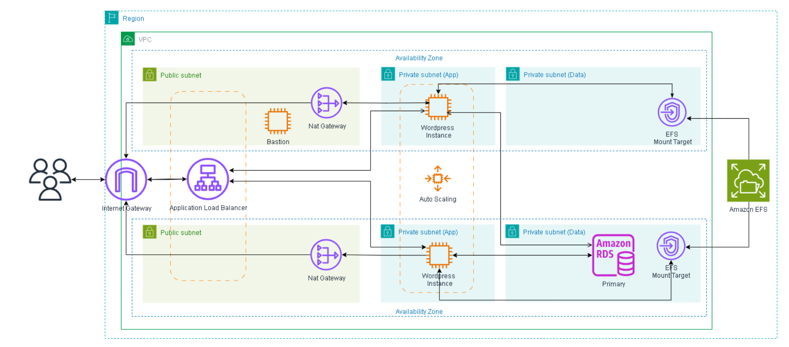

# Projeto 2 - Configuração de Servidor Web Utilizando Wordpress e Docker na AWS

## Objeitvo

## 1 Configuração da Rede

### 1.1 Criação da VPC

- `Name`: `desafio-wordpress-vpc`
- IPv4 CIDR manual input
- Bloco CIDR: `10.0.0.0/16`
- No IPv6 CIDR block
- **Tags (essas serão nossas tags default):**
- `CostCenter`: `**********`
- `Project`: `PB - JUN 2025`

### 1.2 Criação das Sub-redes

Todas vão ser criadas na VPC que acabamos de criar, as sub-redes públicas serão responsáveis por abrigar os gateways NAT, já as sub-redes privadas serão responsáveis por abrigar as instâncias EC2 que estarão rodando nosso aplicativo.

**Sub-rede Pública 1:**
- `Name`: `subnet-wordpress-publica-1`
    - Zona de Disponibilidade: `us-east-1a`
    - Bloco CIDR: `10.0.1.0/24`
    - `Aplicar Tags`
- **Configuração Adicional:** Habilitar "Auto-assign public IPv4 address" para que as instâncias EC2 recebam IPs públicos automaticamente.

**Sub-rede Pública 2:**
- `Name`: `subnet-wordpress-publica-2`
    - Zona de Disponibilidade: `us-east-1b`
    - Bloco CIDR: `10.0.2.0/24`
    - `Aplicar Tags`
- **Configuração Adicional:** Habilitar "Auto-assign public IPv4 address" para que as instâncias EC2 recebam IPs públicos automaticamente.

**Sub-rede Privada 1:**
- `Name`: `subnet-wordpress-privada-1`
    - Zona de Disponibilidade: `us-east-1a`
    - Bloco CIDR: `10.0.3.0/24`
    - `Aplicar Tags`

**Sub-rede Privada 1:**
- `Name`: `subnet-wordpress-privada-2`
    - Zona de Disponibilidade: `us-east-1b`
    - Bloco CIDR: `10.0.4.0/24`
    - `Aplicar Tags`

### 1.3 Criação dos Security Groups (SG)

Aqui já vamos fazer a criação e configuração dos Security Groups para já facilitar posteriormente na configuração de novos serviços. Perceba que aqui já dá para ter uma boa ideia de como o sistema vai se comunicar.

- `Name`: `DesafioWordpressALBSecurityGroup`
    - **Description**: Allow HTTP/HTTPS from anywhere
    - **VPC**: desafio-wordpress-vpc
    - **Regras de Entrada (Inbound Rules):**
        - **HTTP:** Permitir tráfego de `Anywhere` (`0.0.0.0/0`) para que o site seja acessível publicamente.
        - **HTTPS:** Permitir tráfego de `Anywhere` (`0.0.0.0/0`) para que o site seja acessível publicamente.
    - **Regras de Saída (Outbound Rules):**
        - **All trafic:** Manter regra padrão que permite tráfego para `0.0.0.0/0`.

- `Name`: `DesafioWordpressEC2SecurityGroup`
    - **Description**: Allow HTTP from ALB and NFS from EFS
    - **VPC**: desafio-wordpress-vpc
    - **Regras de Entrada (Inbound Rules):**
        - **HTTP:** Permitir tráfego de `DesafioWordpressALBSecurityGroup`.
        - **HTTPS:** Permitir tráfego de `DesafioWordpressALBSecurityGroup`.
    - **Regras de Saída (Outbound Rules):**
        - **All trafic:** Manter regra padrão que permite tráfego para `0.0.0.0/0`.

- `Name`: `DesafioWordpressRDSSecurityGroup`
    - **Description**: Allow MySQL from EC2
    - **VPC**: desafio-wordpress-vpc
    - **Regras de Entrada (Inbound Rules):**
        - **MYSQL/Aurora (3306):** Permitir tráfego de `DesafioWordpressEC2SecurityGroup`.
    - **Regras de Saída (Outbound Rules):**
        - **All trafic:** Manter regra padrão que permite tráfego para `0.0.0.0/0`.

- `Name`: `DesafioWordpressEFSSecurityGroup`
    - **Description**: Allow NFS from EC2
    - **VPC**: desafio-wordpress-vpc
    - **Regras de Entrada (Inbound Rules):**
        - **NFS (2049):** Permitir tráfego de `DesafioWordpressEC2SecurityGroup`.
    - **Regras de Saída (Outbound Rules):**
        - **All trafic:** Manter regra padrão que permite tráfego para `0.0.0.0/0`.

- `Name`: `DesafioWordpressBastionHostSecurityGroup`
    - **Description**: Allow SSH from Me
    - **VPC**: desafio-wordpress-vpc
    - **Regras de Entrada (Inbound Rules):**
        - **SSH (22):** Permitir tráfego de `My IP` permitindo que você acesse as instâncias EC2 usando o protocolo SSH pelo Bastion Host.
    - **Regras de Saída (Outbound Rules):**
        - **All trafic:** Manter regra padrão que permite tráfego para `0.0.0.0/0`.

- **Agora vamos voltar e adicionar uma regra em `DesafioWordpressEC2SecurityGroup`:**
    - **NFS** vindo de `DesafioWordpressEFSSecurityGroup`.

### 1.4 Criação e Configuração do Internet Gateway (IGW), NAT Gateways e Tabelas de Roteamento

1.  **Criação do Internet Gateway (IGW):**
    - `Name`: `igw-desafio-wordpress`
    - `Aplicar Tags`
    - `Ações` > `Anexar à uma VPC` > `Anexar IGW na nossa VPC`

2. **Criação dos NAT Gateways:**
    - `Name`: `nat-gateway-desafio-wordpress-1`
        - `Subnet`: `subnet-wordpress-publica-1`
        - `Connectivity type`: `Public`
        - `Allocate Elastic IP`
    - `Name`: `nat-gateway-desafio-wordpress-2`
        - `Subnet`: `subnet-wordpress-publica-2`
        - `Connectivity type`: `Public`
        - `Allocate Elastic IP`

3.  **Criação da Tabela de Roteamento Pública:**
    - `Name`: `rtb-desafio-wordpress-publica`
        - **VPC:** `desafio-wordpress-vpc`.
        -   `Aplicar Tags`
    - **Rotas:** Adicionar uma rota com `Destination: 0.0.0.0/0` (todo o tráfego da internet) e `Target: igw-desafio-wordpress`.
    - **Associações de Sub-rede:** Associar esta tabela de roteamento às nossas sub-rede públicas (subnet-wordpress-publica-1 e subnet-wordpress-publica-2).

4.  **Criação das Tabelas de Roteamento Privadas:**
    - `Name`: `rtb-desafio-wordpress-privada-1`
        - **VPC:** `desafio-wordpress-vpc`.
        -   `Aplicar Tags`
    - **Rotas:** Adicionar uma rota com `Destination: 0.0.0.0/0` (todo o tráfego da internet) e `Target: nat-gateway-desafio-wordpress-1`.
    - **Associações de Sub-rede:** Associar à subnet-wordpress-publica-1.

    - `Name`: `rtb-desafio-wordpress-privada-2`
        - **VPC:** `desafio-wordpress-vpc`.
        -   `Aplicar Tags`
    - **Rotas:** Adicionar uma rota com `Destination: 0.0.0.0/0` (todo o tráfego da internet) e `Target: nat-gateway-desafio-wordpress-2`.
    - **Associações de Sub-rede:** Associar à subnet-wordpress-publica-2.

## 2 Criação do Banco de Dados (RDS)

- `Engine`: `MySQL`
- `Templates`: `Free tier`
- `DB instance identifier`: `database-desafio-wordpress`
- **configure e guarde a senha escolhida**
- `DB instance class`: `db.t3.micro`
- `Storage type`: `General Purpose SSD (gp3)`
- `Allocated storage`: `20`
- **Connectivity**:
    - **não vamos conectar à nenhuma instância EC2 por agora**
    - `VPC`: `desafio-wordpress-vpc`
    - `Public access`: `No`
    - `VPC security group`: **choose existing**
        - `Existing VPC security groups`: `DesafioWordpressRDSSecurityGroup`
        - `AZ`: `us-east-1a`
- `Database authentication`: `Password authentication`

## 3 Criação do Elastic File System (EFS)

1. **File System Settings**
    - `Name`: `WordPress File System`
    - `File system type`: `Regional`
    - `Automatic bakcups`: `Desativado`
    - `Transition into Archive`: `None`

2. **Network Access**
    - `VPC`: `desafio-wordpress-vpc`
    - `Mount targets`:
        - `us-east-1a`
            - `subnet-wordpress-privada-1`
            - `IPv4 only`
            - `DesafioWordpressEFSSecurityGroup`
        - `us-east-1b`
            - `subnet-wordpress-privada-2`
            - `IPv4 only`
            - `DesafioWordpressEFSSecurityGroup`
